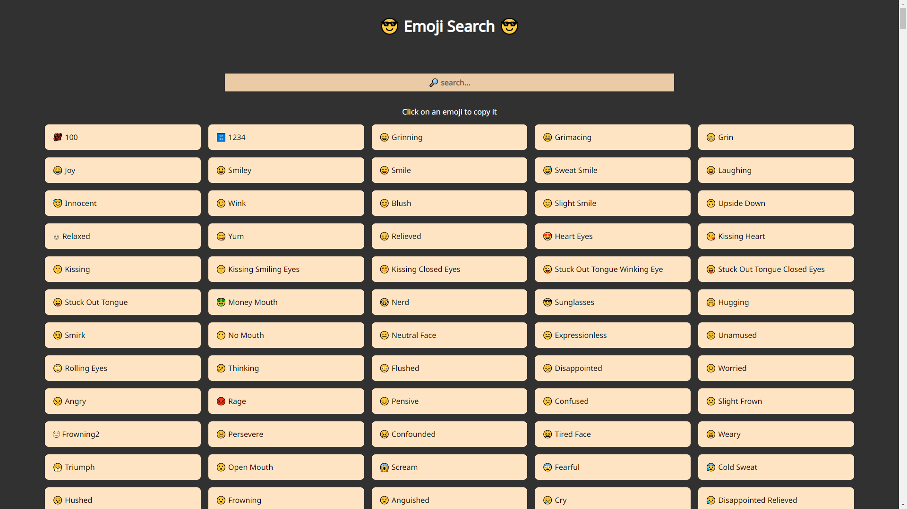
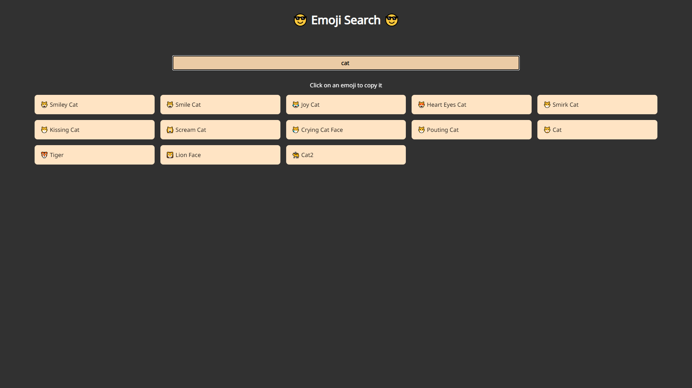

# Emoji Search

A React website done during my training at [BeCode](https://becode.org/).

## The Goal

The goal was to build a website with React to search for emojis based on the keywords entered by the user.

- React
- SASS

## What does it look like ?

Check the result ➡️ [here](https://dystrima.github.io/emoji-search/) ⬅️

